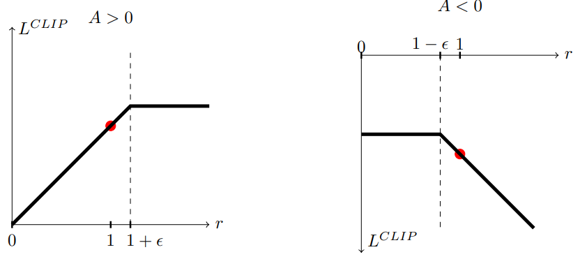
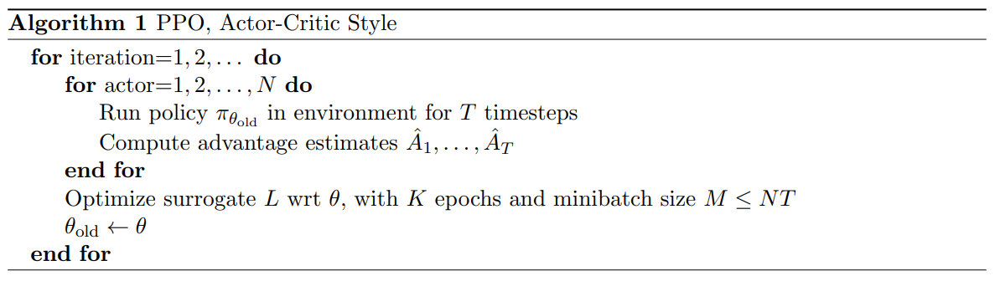

### 2 Background: Policy Optimization 背景: 策略优化
#### 2.1 策略梯度方法
梯度估计（**gradient estimator**）
$$ \hat g=\hat{\Bbb E_t}[\nabla_\theta log \pi_\theta(a_t|s_t) \hat{A_t}] $$
$A_t$:在时间t时刻的**advantage function**

> Implementations that use automatic differentiation software work by constructing an objective function whose gradient is the policy gradient estimator; the estimator $\hat g$ is obtained by differentiating the objective
$\hat g$是对目标函数的微分？

$$ L^{PG}(\theta)=\hat{\Bbb E_t}[ log \pi_\theta(a_t|s_t) \hat{A_t}] $$

> While it is appealing to perform multiple steps of optimization on this loss $L^{PG}$ using the same trajectory, doing so is not well-justified, and empirically it often leads to destructively large policy updates 
尽管使用同样的轨迹去优化loss$L^{PG}$看起来具有吸引力，但是这并不正当，经验上也不好用。

### 3 Clipped Surrogate Objective 截断替代函数

TRPO 最大化替代函数
$$L^{CPI}(\theta) = \hat\Bbb E_t[r_t(\theta)\hat A_t] \tag 1$$
其中的CPI是**conservative policy iteration**（保守策略迭代）

概率比值： $$r_t(\theta) = \frac{\pi_\theta(a_t|s_t)}{\pi_{\theta_{old}}(a_t|s_t)}$$

所以，$r_t(\theta_{old}) = 1 \rightarrow (r(\theta_{old}) = 1)$

没有限制，最大化$L^{CPI}(\theta)$会导致巨大的策略更新，当$r_t(\theta)$远离1的时候，需要做出惩罚。

$$L^{CLIP}(\theta) = \hat\Bbb E_t[min(r_t(\theta)\hat A_t, clip(r_t(\theta),1-\epsilon,1+\epsilon)\hat A_t)] \tag 1$$

当**advantage**的符号变化是，界限变成（$1+\epsilon / 1-\epsilon$）

### 5 Algorithm 算法
不同替代函数的loss与典型的策略梯度实现具有很小的区别，能够响应的计算出。
许多技术使用状态价值函数计算方差减少的advantage function估计，比如**generalized advantage estimation**（参考文献1），finite-horizon estimators。如果使用神经网络（策略和价值函数共享参数），必须要把**策略替代函数和价值函数的error项结合到损失函数中**。目标函数？还必须得加入熵的奖励来保证足够的探索。综上，得到如下的目标函数:
$$L_t^{CLIP+VF+S}(\theta) = \hat{\Bbb E_t}[L_t^{CLIP} (\theta) - c_1L^{VF}_t(\theta) + c_2S[\pi_ \theta](S_ t)]$$
其中$c_1, c_2$是系数，$S$是熵奖励（**entropy bonus**）,$L^{VF}_t$是平方误差损失$(V _{\theta}(s_t) - V^{targ}_t)^2$。
一种风格的策略梯度实现，在参考文献2中流行，适合循环神经网络。在策略上跑T个时间步，使用收集到的采样用作更新。这种风格要求**advantage估计**不能看到时间步长T以后。在参考文献2中使用的估计是：

$$\hat A_t = -V(s_t) + r_t + \gamma r_{t+1}+ ...+ \gamma^{T-t+1}r_{T-1} + \gamma^{T-t}V(s_T)  \tag{a.e.}$$
式子$a.e.$就是传说中的advantage estimator
截断的版本(truncated version):
$$\hat{A_t} = \delta_t + (\gamma \lambda)\delta_{t+1} + ... +(\gamma \lambda)^{T-t+1}\delta_{T-1} \tag{general}$$
where $\delta_t = r_t + \gamma V(s_{t+1}) - V(s_t)$
当$\lambda = 1$时，式子(general)退化(*reduce to*)到式子（a.e.)

#### Proximal Policy Optimization
如下图，PPO算法使用固定长度的轨迹片段。每轮迭代，N个并行的actor收集T个时间步长的数据。然后我们构建替代函数的损失在NT个时间步长的数据，并且使用minibatch的SGD，K个epochs。

- [High-dimensional continuous control using generalized advantage estimation](https://arxiv.org/abs/1506.02438)

-
-
-

-
-
-

*